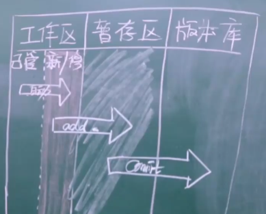

# Git的学习

课程设计：听故事的形式

---

[toc]

---

## 1. git是什么

- 分布式
- 版本控制

​		例如：毕业论文不断修改 版本变化（文件的形式）

​		例如：文案、视频...各行各业

​		发展：

  		1. 文件cv（n多文件）
  		2. 本地版本控制：只有1个文件——》其他的存档保留了（没有多文件，只有单一文件）

​		如果多人协作完成同一任务呢？各自的本地机器明显不方便

 3. 集中式版本控制：有个中心、A、B——》典型软件：SVN

    所有版本都存在中心，A B各自拿到某一个版本

​	问题：如果断网提交不过去

4. 分布式版本控制

   所有版本在每一台电脑上也会存在，如果中心仓库挂掉了也没关系，每一个版本都在每一个机器上，不会影响到代码的完整性

   

如果A提交v4先提交到本地，再推到中心；而集中式就是直接推到中心

- 软件

​		

现在分布式版本控制用的是比较多的

## 2. 为什么要做版本控制？

开发：

公司业务量的增大

功能越来越多

理由：

防止线上代码出问题，可以“回滚”

开发新功能，又去掉——》不可能一点点删掉，如果能回滚到之前的版本就很方便

## 3. 安装git

安装：指的是安装在自己的电脑上

目前指的是：只能在自己的电脑上做版本控制

下载地址：[git安装](https://git-scm.com/download/win)

一直下一步就行了

检验是否安装成功：

​		`git --version`

## 4. 本地管理

第一阶段：一个人写代码，考虑版本迭代问题

使用git帮助我们版本控制：管理某一个文件夹

1. 进入要管理的文件夹

   

2. 初始化，即让git帮助我们管理当前文件夹

   右键——git bash here

   `git init`

   (生成.git隐藏文件)

3. 管理

   `git status`：检测当前文件夹下文件状态

   `git add index.html`：管理当前文件

   此时`git status`，管理的文件是绿色的；未管理的文件红色的；

   `git add .` ：管理当前文件夹下未被管理的文件

   三种状态的变化：

   - 红色：新增的文件 / 修改了原来的老文件 ——》`git add 文件名 / .`
   - 绿色：git已经管理起来了  ——》`git commit -m '描述信息'`
   - 生成版本：

4. 个人信息配置：用户名、邮箱（配置一次即可）

   

5. 生成版本

   

   `git commit -m 'v1'`

   

   `git status`

   什么都没有了，已经被管理并生成一个版本了

   

​		如果对文件进行了修改：`git status`

​		此时又得管理：`git add .`

​		生成版本：`git commit -m 'v2'`

6. 查看版本记录

   查看日志：`git log`

## 5. git三大区域

前情：之前表述，不专业（红色、绿色。。。）

工作区：

​		已管理

​		新增/修改

​		（自动检测）

暂存区：

​		缓冲的地方

​		add提交到暂存区

版本库：

​		commit提交到版本库

## 6. 回滚

第一阶段：自己写完，上线了

第二阶段：开发新功能

​			短视频

第三阶段：又有新功能

​			新功能，但是不要了

`git reset --hard  版本号`

版本号:commit后面的一连串字符

第四阶段：不需要的功能不要了

​		`git log`

​		`git reflog` 查看并想要回滚到后面的版本

​		`git reset --hard 版本号 `

## 7. 总结

`git checkout -- index.html`

`git reset HEAD index.html`

## 8. 分支

分支可以给使用者提供多个环境，意味着你可以把你的工作从开发主线上分离出来，以免影响开发主线。

版本v1

​	例如100个文件

​			修改了10个，新增了20个文件——》90个文件没有动

版本v2

​	只会保留修改的部分，未修改的部分指向的是上一个版本

## 9. 紧急修复线上bug的思路

正在开发的新功能的时候，需要紧急修复上个版本的功能

目前开发一半怎么办？能暂时保存吗

主干		master

分支		dev / bug

在分支上进行紧急修复，后面再合并到主干上

## 10. 基于分支修复线上bug的具体过程

`git branch`

​		打印出所有分支并标志当前所处的分支

创建分支：

`git branch dev`

切换分支：

`git checkout dev`

​		在该分支写代码，不会影响主干

紧急修复bug：

`git branch bug`

`git checkout bug`

修复完需要把它合并到主分支上

`git checkout master`

`git merge bug`

此时bug分支就没有用了

删掉 `git branch -d bug`

此时又回到开发的分支

`git checkout dev`

此时这个分支bug还没有修复，但是你不管，你只要关注你的新功能的开发

此时把新功能合并到主分支上

`git checkout master`

`git merge dev`

此时可能会有冲突

改了同一行，git不知道怎么合并

手动修改（后面会有软件帮助你解决冲突）

## 11. 命令总结和工作流

命令总结：

工作流：

比如：公司让你开发一个新功能

你一般情况都要自己开分支

master一般都是不动的，稳定版本

等到自己开发的功能稳定了（公测完），再合并到主分支上！

