# Github的学习


## 1. github了解

前情提要：还是一个人在工作，并且版本控制什么的都是在本地。

U盘 —— 百度云 ——GitHub


git 和 github是没有什么直接关系的

git是个软件

github是个代码托管的仓库


github帮你托管：

提前要准备的步骤：

1. 注册账号
2. 创建仓库
3. 本地代码推送到远程仓库（因为是分布式，所以多版本，多分支都会被推到仓库）


## 2. 基于github做代码管理

- 打包推送到github

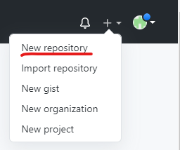

美[rɪˈpɑːzətɔːri]


仓库名：尽量和项目名称一致

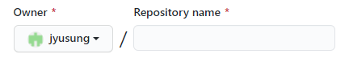

简介：介绍

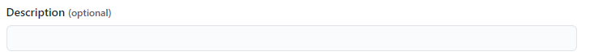

公有/私有：

​		开源精神

​		自己能看到 （私有是收费的）

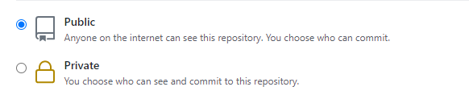

如果都不选，创建新的空的仓库

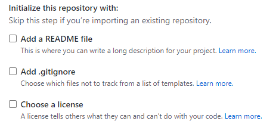

自动创建README文件：介绍该项目

gitignore：忽略该文件夹下的文件，不会进行版本控制

license：能用不能商用等信息。。。


网址：代指的就是远程的仓库地址，推到该地址，就是推到该仓库

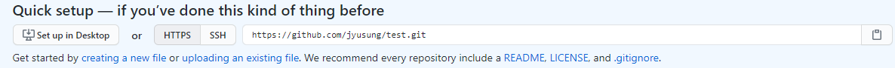


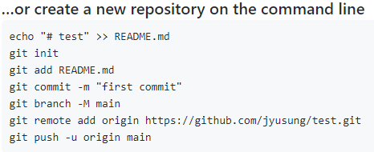

起别名：origin

​		这个别名 代指 url

​		main是分支 （现在是main，之前说master）

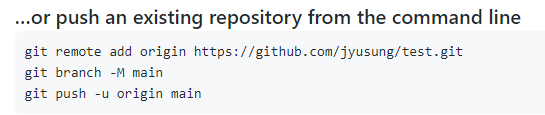

如果之前配置过：可以删除

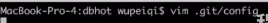

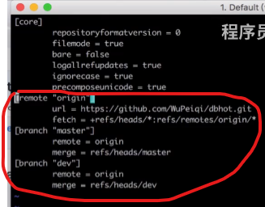

红色部分都删除即可


- 从github上下载下来

  ```GO
  git clone 地址 （内部已经实现git remote add origin 远程仓库地址——已经起别名）
  ```

注意：其实所有分支都clone下来了，但是没有显示，不过我们可以切换的

## 3. 指令总结

```
git remote add 别名 仓库地址
git push -u 别名 分支名


git clone 仓库地址
```


## 4. 如何两地办公

- 在公司开发：

1. 切换到dev分支进行开发

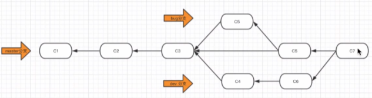

2. 注意：要注意dev分支的版本是不是比master旧，需要先更新过来

   `git merge master`

   -u 是默认的意思，先手动推就行了

3. 比如说：开发了一个新功能

   ```python
   touch app1.py
   ```

4. 提交代码

   `git add .`

   `git commit -m 'xx'`

   `git push origin dev`


- 回到家中：

1. 切换到dev分支进行开发

   `git checkout dev`

2.  更新代码

   此时不再需要clone（clone是完全没有代码）

   现在是有代码，更新就行了

   `git pull origin dev`

3. 继续开发

   然后在家又开发了新的功能

   ```python
   touch app2.py
   ```

4. 提交代码

   ```python
   git add .
   git commit -m 'xx'
   git push origin dev
   ```

   

总结就是：

写之前写pull拉下来更新；走之前先push推送


...

开发完毕之后，要上线

把dev的分支合并到master分支上

```
git checkout master
git merge dev

git push origin master

# dev也是最新的，也可以切换到dev分支，把dev分支也提交到服务器
```


## 5. 忘记推送代码

```
git add .
git commit -m 'C1'  // 某个功能开发到了50%

>>>
但是忘记推送到github了，只在本地更新了一个版本
>>>

在家的时候，只能先开发其他的功能，推送到github


>>> 到公司
拉代码，家里的其他功能 和 本地的C1 合并的过程可能就会有冲突


```

命令补充：

```
git pull origin dev
等同于两个命令，虽然一般情况下并不会这么干
git fetch origin dev
git merge origin/dev
```

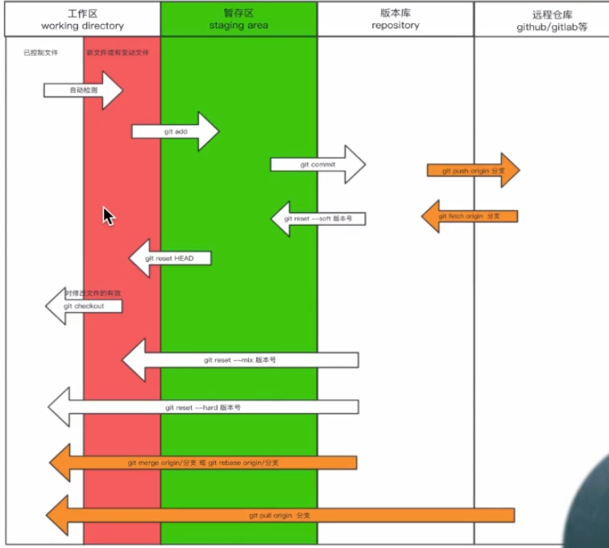
