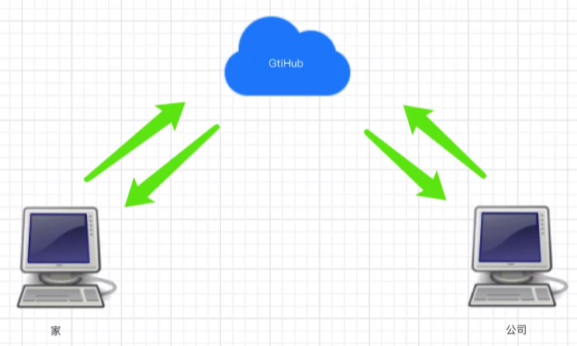

# Github的学习


## 1. github了解

前情提要：还是一个人在工作，并且版本控制什么的都是在本地。

U盘 —— 百度云 ——GitHub



git 和 github是没有什么直接关系的

git是个软件

github是个代码托管的仓库


github帮你托管：

提前要准备的步骤：

1. 注册账号
2. 创建仓库
3. 本地代码推送到远程仓库（因为是分布式，所以多版本，多分支都会被推到仓库）


## 2. 基于github做代码管理

- 打包推送到github


美[rɪˈpɑːzətɔːri]


仓库名：尽量和项目名称一致


简介：介绍


公有/私有：

​		开源精神

​		自己能看到 （私有是收费的）


如果都不选，创建新的空的仓库


自动创建README文件：介绍该项目

gitignore：忽略该文件夹下的文件，不会进行版本控制

license：能用不能商用等信息。。。


网址：代指的就是远程的仓库地址，推到该地址，就是推到该仓库


起别名：origin

​		这个别名 代指 url

​		main是分支 （现在是main，之前说master）


如果之前配置过：可以删除


红色部分都删除即可


- 从github上下载下来

  ```GO
  git clone 地址 （内部已经实现git remote add origin 远程仓库地址——已经起别名）
  ```

注意：其实所有分支都clone下来了，但是没有显示，不过我们可以切换的

## 3. 指令总结

```
git remote add 别名 仓库地址
git push -u 别名 分支名


git clone 仓库地址
```

