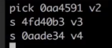

# rebase的使用（面试|很重要）

独立的知识点

英文：rebase

中文：变基

作用：git提交记录变得非常简洁


## 1. rebase应用场景一

多个提交记录 整合 成一个记录

案例：

```
最初始的版本C1——第一天——第二天——第三天——第四天——第五天开发完成

对于自己而言:每天开发一点，并提交记录
对于老板或者对于其他人而言:只需要最初的版本和最终完成的版本，中间的记录并没有什么意义
```


```
git rebase -i 版本号  // 目前最新的到该版本号

git rebase -i HEAD~3  // 目前最新的合并最新的三条记录

```


改成：




当前版本合并到上一个版本去

然后:


效果：


使用注意：

​		合并记录时，不要合并已经push到仓库的记录（会很乱）


## 2. rebase应用场景二

多分支的情况

​		master 线上稳定的版本

​		dev 正在开发的版本

dev分支和master分支合并的时候，可能会是如下的【记录】：


但是，可能我想它的记录是一条线的


以前是merge合并

```
git log --graph
git log --graph --pretty=format:"%h %s"  // hash值，记录
```

现在rebase

```
//先切换到dev的分支

git rebase master

// 切换到master 分支

git merge dev

现在的提交记录就是一条线了，而不是分叉的
```


## 3. rebase应用场景三及注意事项


之前”忘记推送代码“的情况，记录会产生分叉

```
// 
git pull origin dev
等价于 git fetch origin dev + git merge dev


//
git fetch origin dev  
git rebase origin/dev
```


注意：

​		如果在使用rebase的时候产生冲突

​		解决：

​				`git add .`

​				`git rebase --continue`

