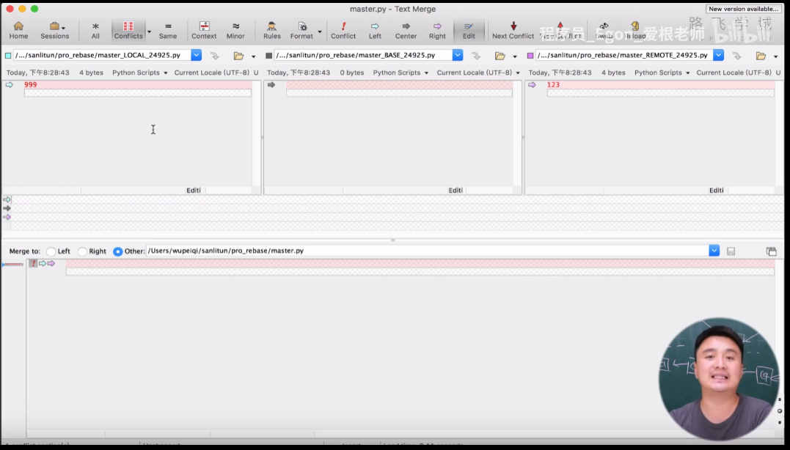

# beyond compare快速解决冲突

## 1. 引入

冲突特别烦，打开修改很麻烦


作用：帮助我们快速解决冲突


两个软件产生关系，联动起来

## 2. 快速解决冲突

1. 安装beyond compare

2. 在git中配置

   ```
   git config --local merge.tool bc3  // 合并工具起了个名“bc3”
   git config --local mergetool.path '/usr/local/bin/bcomp'  //安装目录
   git config --local mergetool.keepBackup false  //解决完冲突不保留元文件
   
   
   // E:\Beyond Compare 4
   // --local 表示只在当前项目有效
   ```

url：[Beyond Compare for mac](https://macwk.com/soft/beyond-compare)

3. 应用beyond compare 解决冲突

   ```
   git mergetool
   ```

   

自己的有问题：暂时不知道怎么解决

```
The merge tool bc3 is not available as 'bcompare' 
```

