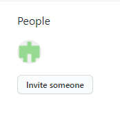
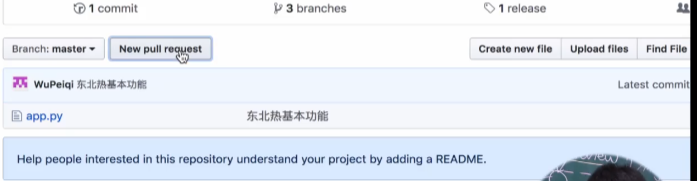

# 5. 多人协同开发

之前：自己单枪匹马开发

现在：自己不开发了，只做代码检查review的工作

​			让别人进行开发


## 1. 多人协同开发gitflow工作流思路（面试）

面试题：公司怎么做多人协同的开发？

解答：每个人有自己的分支，在自己的分支上写代码


某一天某个功能做完了，给老大code review做代码检查——代码没问题就合并到dev

	1. 某些小公司可能直接就上线了（会少几个分支）；
	2. 大公司有一个新的分支——预发布 release —— 测试修复、写各种文档 —— 再真正上线

此时开发该功能的分支就结束了，一般来说这个分支就没有用了——删除掉（一般来说都是以功能名做分支名，而不会以人名）


 第二个功能：


正规团队的操作：

有些可能会忽略：release和code review


## 2. 多人协同开发之创建初始项目和版本

创建多人协同开发的新仓库：

邀请别人，别人才能有权限

方式一：适用于个人


方式二：公司比较适合

先创建组织，再在组织中创建项目


项目刚开启的时候是没有成员的，这里暂时先跳过（当然在这个步骤是可以邀请的）


此时组织已经创建完了，该组织下可以创建很多个仓库，也可以对邀请的成员进行权限的控制。

然后现在创建一个仓库


commit：一连串的东西hash值

引入新的东西：一般公司会用tag，给hash值打上标签，做版本管理

```
git tag -a v1 -m '第一版'
git push origin --tags
```


## 3. 多人协同开发之邀请成员

创建新分支并切换到新的分支

```
git checkout -b dev

之前是:
git branch dev
git checkout dev
```


作为leader应该先创建dev分支，下属是根据这个dev创建分支的




下属就应该是member成员即可，该用户就会收到邮件


## 4. 多人协同开发之邀请小弟参与开发

默认是：成员的权限是只读的，不能提交


当然，对某个项目也能邀请成员，也能设置权限（上面是对组织的设置）


假设你是公司新入职的员工: 你拿到的需求是开发斗地主的功能

```
// 1.先clone下来
git clone https://github.com/team-of-sung/gitlearn.git

// 2.切换到项目的dev分支再开自己的分支
git checkout dev
git checkout -b ddz


// 3.开发。。。提交 重复多次
// 第一天
git add .
git commit -m 'v1.0'
git push origin ddz

// 。。。
// 第n天开发完成
git add .
git commit -m 'v2.0'
git push origin ddz
```

## 5.多人协同开发之代码review


面试题：谁来做，怎么做

应该做，leader来做


github上的 pull/ merge request 来实现

需要先做配置

```
```

GitHub旧版本:


需要几个人review。。（都默认就好啦~）

然后重新回到界面


小弟找老大review




对于leader而言:


可以在网上进行review也可以拉到自己电脑在review

功能开发完了，是否删除分支


注意：现在新版已经需要付费才可以“添加规则”了：


## 6. 多人协同开发之测试上线

测试，或者预发布


测试没有问题就能合并到master分支上去

测试团队，或者leader负责人。。。


```
git checkout -b release
git push origin release

// 一般只修复bug，不会有新功能
```

