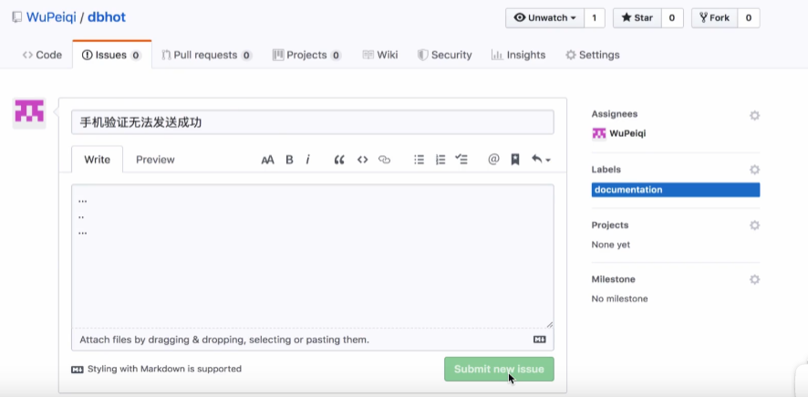

# 

## 2. 给开源项目贡献代码

1. fork？

   ——拷贝一份到自己的仓库

比如 fork，日常用词就是个叉子，在 unix 中引申成创建新进程（进程分叉了）。

2. 在自己的仓库进行代码的修改
3. pull request


## 3 免密登录

免密登录

以前旧版本的话，每次push都要用户名密码，非常麻烦

- URL
- SSH


```
cat id_rsa.pub // 拷贝出来
```


在github上设置

- git自动管理凭证（这就是现在当前版本的git在push的时候不用反复输入的原因）


应用：

- 个人：个人本地去用的时候，git自动管理凭证是最方便也是用的最多的
- 企业：企业的话用SSH用的最多


## 4. 忽略文件

先

`vim .gitignore`

创建文件

在这个文件里头操作

```
还可以写自己
.gitignore

*.h // 只要以这个结尾的
!a.h  // 该文件排除
files/  // 会忽略该文件夹霞的所有文件
```


应用场景：只推送代码，不推送数据库文件

​			敏感数据不能推送到远程


## 5. 任务管理相关

- issues

  

  问题集合等等

  以后遇到问题了，可以先过来看看之前公司有没有遇到类似的问题

- wiki

  项目介绍、描述，当前项目的wiki。给别人看

